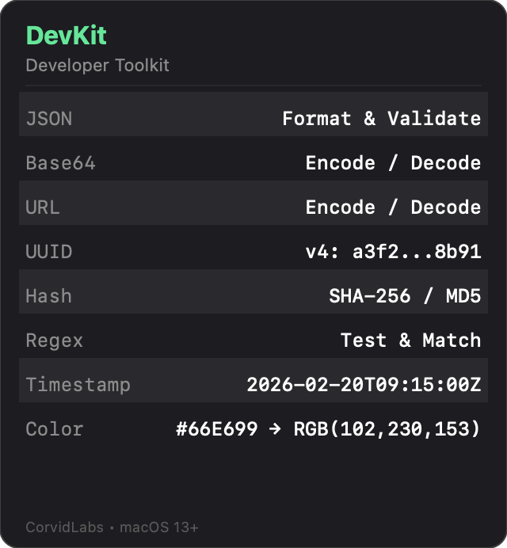

# DevKit

Developer toolkit for macOS menu bar. Provides quick access to 8 common developer utilities.



## Tools

| Tool | Description |
|------|-------------|
| JSON | Format & validate JSON |
| Base64 | Encode / decode Base64 |
| URL | Encode / decode URLs |
| UUID | Generate v4 UUIDs |
| Hash | SHA-256 & MD5 hashing |
| Regex | Test & match patterns |
| Timestamp | Unix ↔ ISO 8601 conversion |
| Color | Hex ↔ RGB conversion |

## Build

```
swift build
```

## Run

```
swift run DevKit
```
